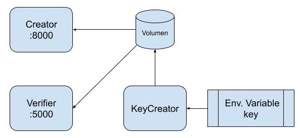
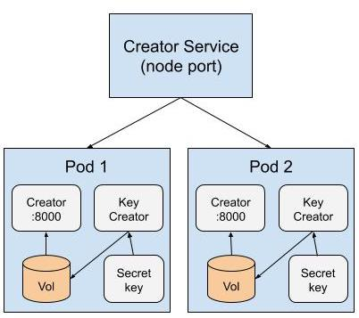
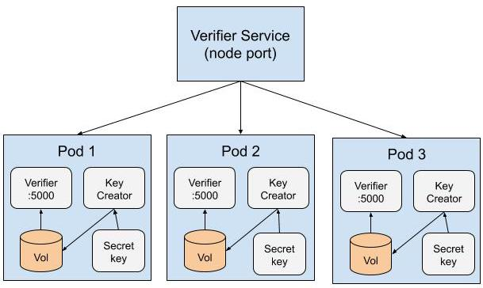

# Práctica Docker/Kubernetes

La práctica a realizar estará basada en la creación de imágenes Docker a través de ficheros Dockerfile, el uso de docker compose para levantar varios contenedores Docker con distintos servicios y finalmente la creación de los ficheros de manifiesto de Kubernetes para desplegar dicha insfrastuctura en Kubernetes, en nuestro caso [minikube](https://minikube.sigs.k8s.io/docs/start/).

La arquitectura de la práctica consiste en tres componentes: creador de tokens (JWT), verificador de dichos tokens, y un tercero que será el que provea la clave usada por los dos servicios anteriores.

A continuación se puede ver la arquitectura que se desea implementar usando Docker Compose:

*
Arquitectura Docker Compose
*

Como se puede ver, el servicio **creator** escucha por el puerto 8000 y está escrito en *go*. El servicio **verifier**, escucha por el puerto 5000 y está escrito en *python*. Mientras que el componente **Keycreator** no sirve por ningún puerto, es simplemente un proceso que lo que hace es generar un *hash* de una clave pasada a través de una variable de entorno y almacena dicho *hash* en un volumen compartido, desde el cual los servicios **creator** y **verifier** leerán dicha clave y la usarán para crear y verificar *tokens*. Aquí hay que tener en cuenta, que la clave debe estar disponible cuando **creator** y **verifier** se arranquen, por lo tanto **Keycreator** tiene que ejecutarse antes que ambos.

En el caso de Kubernetes, la idea es exactamente la misma, pero la architectura varía un poco, como se puede apreciar en el siguiente gráfico:

*
Architectura Kubernetes
*

En este caso se desea la creación de dos despliegues (*deployments*) distintos, uno para **creator** y otro para **verifier**. En el caso del despliegue de **creator**, se desean dos réplicas, mientras que para **verifier**, se desean 3 réplicas.
Para poder acceder a dichos despliegues desde afuera del clúster, también se crearán dos servicios Kubernetes, uno para cada despliegue, del tipo nodePort (el puerto puede ser aleatorio, no tiene por que ser fijo). Por último, la clave que **Keycreator** usa para crear el *hash* deberá estar almacenada en un *secret* de Kubernetes.

Lo que el alumno debe crear:

* Ficheros Dockerfile para los tres componentes: **creator**, **verifier** y **Keycreator**. Se evaluará el uso de buenas prácticas tanto generales como de seguridad, así como el uso de la multifase.
* Creación del fichero docker-compose que cree la arquitectura mostrada en la imagen: Arquitectura Docker Compose.
* Creación de los ficheros manifiesto de Kubernetes que cree la estructura mostrada en la imagen: Arquitectura Kubernetes.
